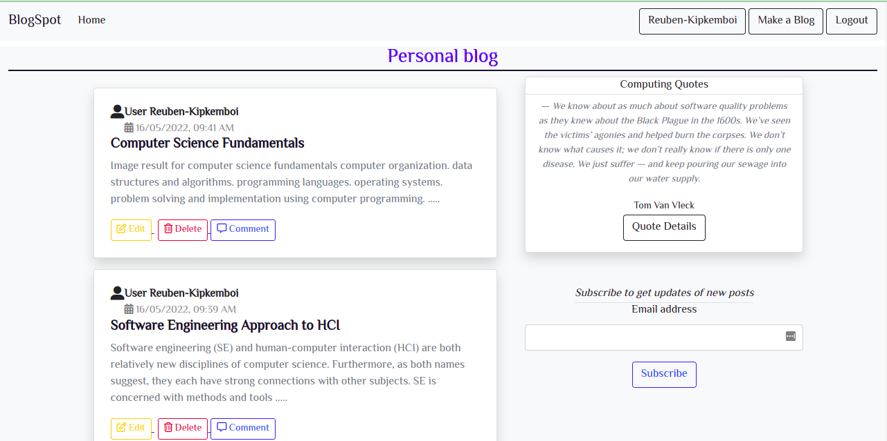
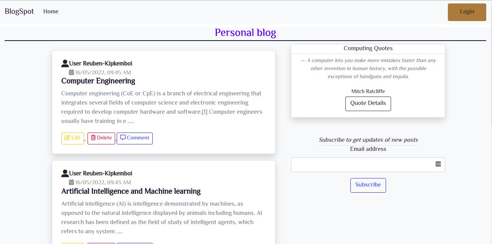

# Personal Blog

### By Reuben Kipkemboi

## Table of Content

+ [Description](#description)
+ [Installation Requirement](#installation-requirements)
+ [Technology Used](#technologies-used)
+ [License](#license)
+ [Authors Info](#authors-info)

## Description
A personal blogging website where you can create and share your opinions and other users can read and comment on them. Additionally, there is a feature that displays random quotes to inspire other users. It therefore basically creates blogs and allows users to comment pn these posts , while writers can delete blogs and also comments.

[Go Back to the top](#personal-blog)


## User Stories

- As a user, I would like to view the blog posts on the site
- As a user, I would like to comment on blog posts
- As a user, I would like to view the most recent posts
- As a user, I would like to an email alert when a new post is made by joining a subscription.
- As a user, I would like to see random quotes on the site
- As a writer, I would like to sign in to the blog.
- As a writer, I would also like to create a blog from the application.
- As a writer, I would like to delete comments that I find insulting or degrading.
- As a writer, I would like to update or delete blogs I have created.


[Go Back to the top](#personal-blog)

Writers view



Users View




## Behaviour Driven Development
| Behaviour | Input | Output |
| :---------------- | :---------------: | ------------------: |
| Application starts | **On page load** | see all available blogs and some inspiring quotes |
| Login| **user email** and **user Password/passcode** | If account already exists redirect to home page and user can see the blogs and subscribe to get updates |
| Sign up/ Register | **Username**, **user email** **password** | Redirects to login page for user to login into the application|
| click on comment button | **Comment** | user submits comments via a form about a certain blog|
| Comment button | **button click** | message flash of commenting successfully|
|Subscription to BlogSpot | **User email Address**| Flash message "Successfully subscribed to BlogSpot for updates on new blogs"|

## Installation Requirements

### Prerequisites

- pip
- gunicorn
- flask
- wtf-forms

## Instructions

1) Git clone the repository to your local computer
```
https://github.com/Reuben-Kipkemboi/personal-blog.git
```
2. change Directory `cd` into blog

```
cd blog
```
3. create a virtual environment

```
python3.8 -m venv virtual
```
4. activate the virtual environment 
```
source virtual/bin/activate

```
5. To deactivate the environment

```
deactivate
```

6. Install Flask

```
pip install flask || pip3 install flask
```
7. Execute start.sh

```python

chmod a+x start.sh

./start.sh

```

[Go Back to the top](#personal-blog)


## Technologies Used


## License
[MIT License](LICENSE)

## Design Link
* [Design](https://www.figma.com/file/r2H9WSgZZYkB7NsFxioBpT/blog?node-id=2%3A2)

## Live Site
* #### https://techy-blog22.herokuapp.com

## Authors Info
* Slack - [Reuben Kipkemboi]()

* Email - [Reuben Kipkemboi](https://gmail.com) :email: 


<p align = "center">
    &copy; 2022 @ Reuben Kipkemboi.
</p>